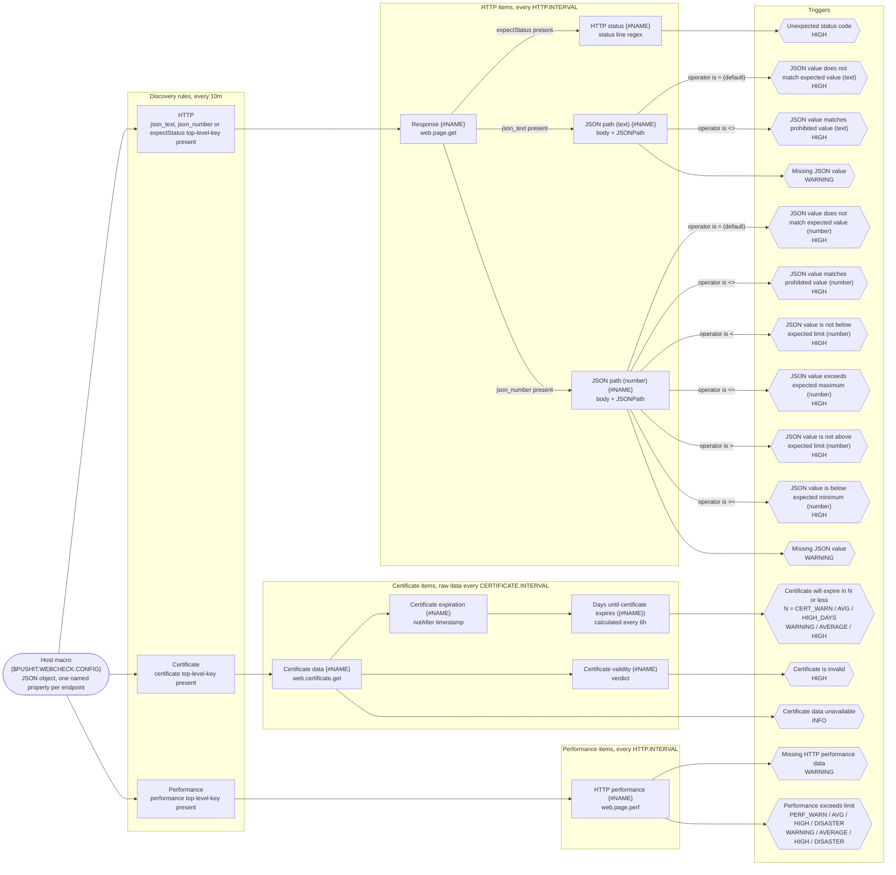

<h1 align="center">PUSH IT Webcheck</h1>

<p align="center">
  <strong>Every health endpoint and TLS certificate on a host, monitored from one Zabbix macro.</strong>
</p>

<p align="center">
  <a href="https://www.zabbix.com/"></a>
  
  
  <a href="LICENSE"></a>
</p>

**PUSH IT Webcheck** is a Zabbix template for hosts that run web services. Describe the endpoints of a host as a
JSON object in the macro `{$PUSHIT.WEBCHECK.CONFIG}`, link the template, and low-level discovery creates the items and
triggers for HTTP status codes, for values inside JSON health responses, for HTTP page load time and for TLS certificate
validity and expiry.
All requests are made by the Zabbix agent on the monitored host itself: `http://localhost:8080/health` means port
8080 on that machine, not on the Zabbix server, so a service bound to `localhost` or to an internal port is as easy
to check as a public one.

## 📚 Table of contents

- [Features](#-features)
- [How it works](#-how-it-works)
- [Quick start](#-quick-start)
- [Endpoint configuration](#-endpoint-configuration)
- [Configuration examples](#-configuration-examples)
- [Macros](#-macros)
- [Items and triggers](#-items-and-triggers)
- [Tips and gotchas](#-tips-and-gotchas)
- [Development](#-development)
- [License](#-license)

## ✨ Features

- 🩺 **Four check types.** HTTP Status, JSONPath, HTTP Performance and Certificate.
- 🧾 **One macro per host.** All endpoints live in `{$PUSHIT.WEBCHECK.CONFIG}`; no item cloning.
- 🏠 **Runs where the service runs.** Checks are Zabbix agent items, so `http://localhost:8080/health` works without
  exposing anything.
- 🧹 **Self-cleaning.** Remove an entry from the macro and its items and triggers disappear on the next discovery
  run.
- 📅 **Three-stage certificate alerts.** WARNING, AVERAGE and HIGH thresholds in days, chosen per endpoint.
- ⏱️ **Multi-stage performance alerts.** WARNING, AVERAGE, HIGH and DISASTER page load time thresholds in seconds, chosen per endpoint.
- ⏳ **Grace periods.** A missing response becomes a problem only after a configurable grace period; a wrong value
  is reported immediately.
- 🎚️ **Tunable with macros.** Intervals and grace periods are user macros you can override per host.

## 🧭 How it works

The template ships three discovery rules of type *Script*, **HTTP**, **Certificate** and **Performance**. Together they
turn the endpoint list in `{$PUSHIT.WEBCHECK.CONFIG}` into items and triggers:



Step by step:

1. **Configuration.** Every endpoint is one JSON object in the host macro `{$PUSHIT.WEBCHECK.CONFIG}`.
2. **Discovery.** All three rules run every 10 minutes and receive the macro through the script parameter `config`.
3. **Collecting items.** Each entry gets the Zabbix agent items for its configured checks: `web.page.get["{#URL}"]` for
   HTTP status and JSON path entries, `web.certificate.get["{#URL}"]` for certificate entries and
   `web.page.perf["{#URL}"]` for performance entries. Performance makes a separate request from HTTP status and JSONPath.
4. **Derived items.** Dependent items extract the interesting part with preprocessing (regular expression and
   JSONPath). Overrides in the HTTP rule enable the dependent item prototypes corresponding to the checks configured for
   the entry. The certificate rule adds a calculated item that turns the `notAfter` timestamp into days.
5. **Triggers.** Trigger prototypes compare the values with your expectations and also raise a problem when no value has
   arrived for longer than the grace period.
6. **Cleanup.** Lost resources are deleted immediately: remove an entry from the macro and its items, triggers and
   history are gone after the next discovery run.

Changes to the macro take effect on the next discovery run, at most 10 minutes later, or right away with **Execute now**
on the applicable discovery rules.

## 🚀 Quick start

From download to the first problem in Zabbix in six steps.

### Requirements

| Requirement | Why |
|---|---|
| Zabbix server 7.4 or later | The template file format requires Zabbix 7.4 or later.  |
| A Zabbix agent on the monitored host | HTTP status and JSONPath use `web.page.get`; HTTP Performance uses `web.page.perf`. Both are available in the classic Zabbix agent and in Zabbix agent 2. |
| Zabbix agent 2 for `certificate` checks | `web.certificate.get` exists in Zabbix agent 2 only. |
| An agent interface on the host | All collecting items are passive *Zabbix agent* items, so the server or proxy must be able to poll the agent. |
| A network path from the agent to the endpoints | Requests are made from the agent, not from the Zabbix server or proxy. `localhost` is the monitored host itself. |

### Steps

1. **Download** `template.dist.yaml` from this repository.
2. **Import the template.** Go to *Data collection → Templates*, click **Import**, select the downloaded file, keep the
   default import rules and click **Import**. **PUSH IT Webcheck** now appears in the template group *Templates*.
3. **Link it to the host** that runs the services: open the host under *Data collection → Hosts* and, on the *Host*
   tab, type `PUSH IT Webcheck` into the *Templates* field, select it and click **Update**.
4. **Configure the endpoints.** Open the host again, switch to the *Macros* tab, select *Inherited and host macros*,
   click **Change** next to `{$PUSHIT.WEBCHECK.CONFIG}` and paste your endpoint list as one line of JSON. For a
   first test, a single HTTP status check is enough (adjust the host, port and path):

   ```json
   {
     "app": {
        "url": "http://localhost:8080/health",
        "expectStatus": "200"
     }
   }
   ```

   Click **Update**.
5. **Run discovery.** Wait for the next run (up to 10 minutes) or open *Data collection → Hosts*, click *Discovery*
   in the row of your host, select **HTTP**, **Certificate** and **Performance** and click **Execute now**. Give the
   server few seconds after saving the macro so that its configuration cache has picked up the new value.
6. **Check the result.** *Monitoring → Latest data*, filtered by your host, shows **Response app** (the raw HTTP
   response) and **HTTP status app** with the value `200`. If the endpoint answers with a different status code, or
   does not answer at all for more than 3 minutes, *Monitoring → Problems* shows **Unexpected status code for app**
   with severity HIGH.

From here, extend the list with the [configuration examples](#-configuration-examples). Every later change to the
macro follows the same path: edit the value, then wait for the next discovery run or use **Execute now**.

## 🧩 Endpoint configuration

`{$PUSHIT.WEBCHECK.CONFIG}` holds a JSON object. The keys of the root level object are human-readable names of the
endpoints to monitor. Since these keys are used inside Zabbix keys, only letters, digits, `_`, `-` and `.` should be
used; no spaces, commas, brackets or quotes. The values are objects describing the check(s). Every object needs at least
the `url` key and additional keys enabling checks.

### Common keys

The following configuration would be incomplete and not result in any items because it defines no checks. But it is a
good start to learn how to structure the configuration.

```json
{
  "my-application": {
    "url": "https://example.org"
  }
}
```

| Key | Description |
|---|---|
| `url` | The endpoint as `scheme://host[:port][/path]`. The default port of the scheme and the root path apply when omitted. |

### Checking the HTTP status

This check is enabled by setting `expectStatus`. It fetches the URL every `{$PUSHIT.WEBCHECK.HTTP.INTERVAL}` (default
`1m`) with the agent item [`web.page.get`](https://www.zabbix.com/documentation/current/en/manual/config/items/itemtypes/zabbix_agent)
and compares the status code from the first line of the response. The body is not evaluated.

```json
{
  "my-application": {
    "url": "https://example.org/",
    "expectStatus": "200"
  }
}
```

| Key | Description |
|---|---|
| `expectStatus` | Expected status code, compared numerically. `"200"` for a plain health endpoint, but any code works, for example `"401"` for an endpoint that is supposed to demand authentication. Any other code raises **Unexpected status code for {#NAME}** (HIGH). |

### Checking a specific field in JSON

This check is enabled by setting `json_text` and/or `json_number`. Some status pages provide a machine-readable JSON
version. You can use this check to query a specific field described by a [Zabbix JSONPath]. It fetches the URL every
`{$PUSHIT.WEBCHECK.HTTP.INTERVAL}` (default `1m`) with the same `web.page.get` item, treats the body as JSON and
compares values in it. The status code is not evaluated by this check.

```json
{
  "my-application": {
    "url": "https://example.org/health.json",
    "json_text": {
      "path": "$.status",
      "expect": "healthy"
    },
    "json_number": {
      "path": "$.unhealthyNodes",
      "expect": 0
    }
  }
}
```

| Key | Description |
|---|---|
| `path` | [Zabbix JSONPath] expression selecting the value, for example `$.status` or `$.components.db.status`. Use a definite path: an expression that returns a list yields a JSON array as text, which is hard to compare. |
| `expect` | Value to compare against, as a string (`json_text`) or number (`json_number`). JSON strings and booleans arrive without quotes (`UP`, `true`), numbers as numbers (`0`). A value that does not satisfy the configured comparison raises a problem on HIGH level. |
| `operator` | Comparison the selected value must satisfy against `expect`; defaults to `"="`. See below for allowed operators |

#### Allowed operators

| Operator | Healthy condition | Supported checks |
|---|---|---|
| `=` (default) | Value equals `expect` | Text and number |
| `<>` | Value differs from `expect` | Text and number |
| `<` | Value is less than `expect` | Number only |
| `<=` | Value is less than or equal to `expect` | Number only |
| `>` | Value is greater than `expect` | Number only |
| `>=` | Value is greater than or equal to `expect` | Number only |

If no value arrives for `{$PUSHIT.WEBCHECK.JSON_PATH.NO_RESPONSE_GRACE}` (default `3m`), a separate trigger raises
**Missing JSON value for {#NAME}** (WARNING). This applies to both text and numeric checks.

### Checking HTTP performance

This check is enabled by setting `performance`. The **Performance** discovery rule creates an agent item
[`web.page.perf`](https://www.zabbix.com/documentation/7.4/en/manual/config/items/itemtypes/zabbix_agent#web.page.perf)
that measures the loading time of the full page in seconds, every `{$PUSHIT.WEBCHECK.HTTP.INTERVAL}` (default `1m`).

```json
{
  "my-application": {
    "url": "https://example.org/health",
    "performance": {
      "nodata": "3m",
      "warning": 0.5,
      "average": 1,
      "high": 2,
      "disaster": 5
    }
  }
}
```

Only the `nodata` key is required; if a key is not given, the related trigger will not be discovered. This allows you to
decide whether you want all levels or go from warning directly to high - skipping average for example.

| Key | Description |
|---|---|
| `nodata` | No-data grace period as a Zabbix time value, for example `"3m"`. Raises **Missing HTTP performance data for {#NAME}** (WARNING) when no value arrives during this period. Choose a value larger than `HTTP.INTERVAL`. |
| `warning` | Load time in seconds above which a WARNING problem is raised. Use a JSON number, for example `0.5`. |
| `average` | Load time in seconds above which an AVERAGE problem is raised. |
| `high` | Load time in seconds above which a HIGH problem is raised. |
| `disaster` | Load time in seconds above which a DISASTER problem is raised. |

Choose `warning` < `average` < `high` < `disaster`. Comparisons are strictly `>`: a value equal to a threshold does not
fire that trigger. The threshold triggers are independent, so a value above `disaster` raises all four problems.

### Checking a certificate

Opens a TLS connection every `{$PUSHIT.WEBCHECK.CERTIFICATE.INTERVAL}` (default `15m`) with the Zabbix Agent 2 item
[`web.certificate.get`](https://www.zabbix.com/documentation/current/en/manual/config/items/itemtypes/zabbix_agent/zabbix_agent2),
validates the certificate for the host name in the URL and reads the expiry date. At the time of writing (Zabbix Agent 2
version 7.4.15), this check **does not consider certificate revocation lists**. A revoked certificate will show up as
valid until it expires. This is a limitation of the `web.certificate.get` item.

```json
{
  "my-application": {
    "url": "https://example.org/",
    "certificate": {
      "warning": 30,
      "average": 14,
      "high": 7
    }
  }
}
```

| Key | Description |
|---|---|
| `warning` | Days before expiry at which a WARNING problem is raised. |
| `average` | Days before expiry at which an AVERAGE problem is raised. |
| `high`    | Days before expiry at which a HIGH problem is raised. |

Choose the thresholds so that `warning` > `average` > `high`, for example `30`, `14` and `7`.

## 📋 Configuration examples

Every example is a complete, valid value for `{$PUSHIT.WEBCHECK.CONFIG}` and follows the rules from
[Endpoint configuration](#-endpoint-configuration).

The examples are pretty-printed for readability. In the macro value the same JSON is usually pasted as one line, as
shown in the [compact form](#compact-form) at the end of this section. Whitespace is irrelevant to JSON but counts
towards the 2048-character macro limit.

### 1. Minimal: one HTTP status check

A single service on port 8080 whose health endpoint must answer `200`.

```json
{
  "app": {
    "url": "http://localhost:8080/health",
    "expectStatus": "200"
  }
}
```

**What you get for `app`**

| Object | Name | Severity |
|---|---|---|
| Item | Response app | – |
| Item | HTTP status app | – |
| Trigger | Unexpected status code for app | HIGH |

The raw response is fetched every minute. The trigger fires when the code is not `200`, or when no code has arrived
for 3 minutes, for example because the endpoint refuses connections.

Any status code works as expectation. An endpoint behind authentication, for example, should answer `401`:

```json
{
  "admin-login": {
    "url": "http://localhost:8080/admin",
    "expectStatus": "401"
  }
}
```

### 2. JSON health endpoints

Spring Boot Actuator answers `GET /actuator/health` with a body such as `{"status":"UP"}`. The first entry selects
`$.status` and expects `UP`. The second watches a cluster which must not have more than 10 failed tasks, the
third reads a boolean from a body like `{"ready":true}`, which is compared as the string `"true"`. The fourth monitors
a queue-worker, which must *not* report the queue status as "full" (`{"queueStatus":"FULL"}`).

```json
{
  "shop-api": {
    "url": "http://localhost:8080/actuator/health",
    "json_text": {
      "path": "$.status",
      "expect": "UP"
    }
  },
  "search": {
    "url": "http://localhost:9200/_cluster/health",
    "json_number": {
      "path": "$.failedTasks",
      "expect": 10,
      "operator": "<"
    }
  },
  "worker": {
    "url": "http://localhost:3000/healthz",
    "json_text": {
      "path": "$.ready",
      "expect": "true"
    }
  },
  "queue-worker": {
    "url": "http://localhost:8081/status.json",
    "json_text": {
      "path": "$.queueStatus",
      "expect": "FULL",
      "operator": "<>"
    }
  }
}
```

**What you get**

| Object | Name | Severity |
|---|---|---|
| Item | Response shop-api / search / worker| – |
| Item | JSON path (text) shop-api / worker / queue-worker | – |
| Item | JSON path (number) search | – |
| Trigger | JSON value for shop-api does not match expected value (text) | HIGH |
| Trigger | JSON value for search is not below expected limit (number) | HIGH |
| Trigger | JSON value for worker does not match expected value (text) | HIGH |
| Trigger | JSON value for queue-worker matches prohibited value (text) | HIGH |
| Trigger | Missing JSON value for shop-api / search / worker / queue-worker | WARNING |

The **does not match expected value** triggers fire when `shop-api` / `worker` differs from `UP` / `true` respectively.
For `search`, the trigger **is not below expected limit** will fire if 10 or more tasks are reported as failed.
For `queue-worker`, the configured comparison is `<> "FULL"`, so its **matches prohibited value**
trigger fires when the selected value is `FULL`.
A separate **Missing JSON value** trigger fires with severity WARNING when no value has arrived for 3 minutes,
for example because the service is down, the body is not JSON or the path does not match.

### 3. Certificate expiry with three thresholds

Warn 30 days before the certificate expires, escalate to AVERAGE at 14 days and to HIGH at 7 days.

```json
{
  "www-cert": {
    "url": "https://www.example.com",
    "certificate": {
      "warning": 30,
      "average": 14,
      "high": 7
    }
  }
}
```

**What you get for `www-cert`**

| Object | Name | Severity |
|---|---|---|
| Item | Certificate data www-cert | – |
| Item | Certificate expiration www-cert | – |
| Item | Certificate validity www-cert | – |
| Item | Days until certificate expires (www-cert) | – |
| Trigger | Certificate data for www-cert is unavailable | INFO |
| Trigger | Certificate for www-cert is invalid | HIGH |
| Trigger | Certificate for www-cert will expire in 30 or less | WARNING |
| Trigger | Certificate for www-cert will expire in 14 or less | AVERAGE |
| Trigger | Certificate for www-cert will expire in 7 or less | HIGH |

The certificate data is fetched every 15 minutes, the days value is recalculated every 6 hours. Use the name the
certificate was issued for (here `www.example.com`), not `localhost`, otherwise the check reports `invalid`.

### 4. A realistic host: several services, all types

A shop server. The public storefront is checked through its own name for status code, certificate and page load time.
Two Spring Boot services answer with JSON health, a protected admin interface is expected to answer `401` without
credentials, and an API on port 8443 has a certificate of its own. `billing-db` reads a component status,
which Actuator only includes when `management.endpoint.health.show-components` or `show-details` is set to `always`
(`when-authorized` does not help, the agent sends no credentials).

```json
{
  "shop-frontend": {
    "url": "https://shop.example.com",
    "expectStatus": "200",
    "performance": {
      "nodata": "3m",
      "warning": 0.5,
      "average": 1,
      "high": 2,
      "disaster": 5
    },
    "certificate": {
      "warning": 30,
      "average": 14,
      "high": 7
    }
  },
  "orders-api": {
    "url": "http://localhost:8080/health",
    "json_number": {
      "path": "$.failedOrders",
      "expect": 0
    }
  },
  "billing-db": {
    "url": "http://localhost:8081/actuator/health",
    "json_text": {
      "path": "$.components.db.status",
      "expect": "UP"
    }
  },
  "admin-auth":{
    "url": "https://shop.example.com/admin",
    "expectStatus": "401"
  },
  "api": {
    "url": "https://api.example.com:8443",
    "expectStatus": "200",
    "certificate": {
      "warning": 21,
      "average": 10,
      "high": 3
    }
  }
}
```

### Compact form

You can use `jq` to produce the compact form from a pretty-printed file and if you chain it with `wc`, you can count the
characters to ensure you stay below the Zabbix-imposed 2048-character limit:

```sh
jq -c . webcheck.json            # validate and print the compact form
jq -cj . webcheck.json | wc -m   # count its characters: at most 2048 fit into a macro value
```

## 🔢 Macros

All macros are defined on the template and can be overridden per host. Time values are Zabbix time expressions such as
`30s`, `5m`, `1h` or `2d`.

| Macro | Default | Used by | Purpose |
|---|---|---|---|
| `{$PUSHIT.WEBCHECK.CONFIG}` | `{}` | discovery rules | The endpoint configuration, a JSON object. Set this on every host. |
| `{$PUSHIT.WEBCHECK.HTTP.INTERVAL}` | `1m` | HTTP status, JSONPath and HTTP Performance checks | Update interval of **Response {#NAME}** and **HTTP performance {#NAME}**. |
| `{$PUSHIT.WEBCHECK.HTTP_STATUS.NO_STATUS_GRACE}` | `3m` | HTTP status check | How long a missing status code is tolerated before **Unexpected status code for {#NAME}** fires. Must be larger than `HTTP.INTERVAL`, otherwise it provides no tolerance and can raise false no-data problems. |
| `{$PUSHIT.WEBCHECK.JSON_PATH.NO_RESPONSE_GRACE}` | `3m` | JSONPath check | How long a missing JSON value is tolerated before **Missing JSON value for {#NAME}** (WARNING) fires. Must be larger than `HTTP.INTERVAL`, otherwise it provides no tolerance and can raise false no-data problems. |
| `{$PUSHIT.WEBCHECK.CERTIFICATE.INTERVAL}` | `15m` | Certificate check | Update interval of the raw item **Certificate data {#NAME}**. |
| `{$PUSHIT.WEBCHECK.CERTIFICATE.NO_DATA_GRACE}` | `30m` | Certificate check | How long missing certificate data is tolerated before **Certificate data for {#NAME} is unavailable** (INFO) fires. Must be larger than `CERTIFICATE.INTERVAL` and smaller than `CERTIFICATE.HISTORY`. |
| `{$PUSHIT.WEBCHECK.CERTIFICATE.HISTORY}` | `90m` | Certificate check | History retention of the raw certificate JSON only. Must be larger than `CERTIFICATE.NO_DATA_GRACE`, should be larger than `CERTIFICATE.INTERVAL` and must be at least `1h`. The derived items are not affected. |

### Keep the timing consistent

Timing at a glance, with the default values:

| Check type | Raw item collected every | No-data grace before the trigger fires | Raw history kept for |
|---|---|---|---|
| HTTP status | `{$PUSHIT.WEBCHECK.HTTP.INTERVAL}` = 1m | `{$PUSHIT.WEBCHECK.HTTP_STATUS.NO_STATUS_GRACE}` = 3m | never |
| JSONPath | `{$PUSHIT.WEBCHECK.HTTP.INTERVAL}` = 1m | `{$PUSHIT.WEBCHECK.JSON_PATH.NO_RESPONSE_GRACE}` = 3m | never |
| HTTP Performance | `{$PUSHIT.WEBCHECK.HTTP.INTERVAL}` = 1m | `performance.nodata` (required per endpoint) | 31d (Zabbix default) |
| Certificate | `{$PUSHIT.WEBCHECK.CERTIFICATE.INTERVAL}` = 15m | `{$PUSHIT.WEBCHECK.CERTIFICATE.NO_DATA_GRACE}` = 30m | `{$PUSHIT.WEBCHECK.CERTIFICATE.HISTORY}` = 90m |

Two rules follow from this:

- **Grace periods must be larger than the interval.** The grace period is the argument of `nodata()`. If it is
  equal to or shorter than the interval, the window runs out between two regular polls and the trigger can raise
  problems on a healthy endpoint. The defaults (1m interval, 3m grace) tolerate two missed polls.
- **`CERTIFICATE.INTERVAL < CERTIFICATE.NO_DATA_GRACE < CERTIFICATE.HISTORY`.** The certificate `nodata()` trigger
  watches the raw item **Certificate data {#NAME}**, whose history is set by `CERTIFICATE.HISTORY`, so the history
  has to outlast the grace period. When you raise one, raise the other with it. The HTTP `nodata()` triggers watch
  the dependent items, which keep the Zabbix default history of 31d, so no such rule applies to them.

## 📦 Items and triggers

Every discovered object carries the name (top level key) of its entry, so items and triggers of different services never
collide and are easy to tell apart in *Latest data* and *Problems*.

The **HTTP** rule creates its dependent prototypes with *Discover* set to *No* and enables the applicable prototypes
through overrides. Each HTTP entry therefore gets the raw item plus the HTTP status item, the JSONPath item(s), or both,
depending on its configuration.

| Override | Condition | Effect |
|---|---|---|
| Enable http_status | Configuration contains `expectStatus` key | Item prototypes whose name matches `^HTTP status.*$` are discovered |
| Enable json_path_text | Configuration contains `json_text` key | Item prototypes whose name matches `^JSON path \(text\).*$` are discovered |
| Enable json_path_number | Configuration contains `json_number` key | Item prototypes whose name matches `^JSON path \(number\).*$` are discovered |
| Enable json_text EQUALS assertion | `{#JSON_OPERATOR_TEXT}` is `=` | **JSON value for {#NAME} does not match expected value (text)** is discovered |
| Enable json_text NOT EQUALS assertion | `{#JSON_OPERATOR_TEXT}` is `<>` | **JSON value for {#NAME} matches prohibited value (text)** is discovered |
| Enable json_number EQUALS assertion | `{#JSON_OPERATOR_NUMBER}` is `=` | **JSON value for {#NAME} does not match expected value (number)** is discovered |
| Enable json_number NOT EQUALS assertion | `{#JSON_OPERATOR_NUMBER}` is `<>` | **JSON value for {#NAME} matches prohibited value (number)** is discovered |
| Enable json_number LESS THAN assertion | `{#JSON_OPERATOR_NUMBER}` is `<` | **JSON value for {#NAME} is not below expected limit (number)** is discovered |
| Enable json_number LESS THAN OR EQUALS assertion | `{#JSON_OPERATOR_NUMBER}` is `<=` | **JSON value for {#NAME} exceeds expected maximum (number)** is discovered |
| Enable json_number GREATER THAN assertion | `{#JSON_OPERATOR_NUMBER}` is `>` | **JSON value for {#NAME} is not above expected limit (number)** is discovered |
| Enable json_number GREATER THAN OR EQUALS assertion | `{#JSON_OPERATOR_NUMBER}` is `>=` | **JSON value for {#NAME} is below expected minimum (number)** is discovered |


<details>
<summary><strong>HTTP Status</strong>: items and triggers</summary>

| Item | Key | Type | Value type | Interval | History |
|---|---|---|---|---|---|
| Response {#NAME} | `web.page.get["{#URL}"]` | Zabbix agent | Text | `{$PUSHIT.WEBCHECK.HTTP.INTERVAL}` | none |
| HTTP status {#NAME} | `pushit.webcheck.http.status[{#NAME}]` | Dependent on Response {#NAME} | Numeric (unsigned) | with the master item | 31d (Zabbix default) |

**Response {#NAME}** holds the raw response: status line, headers and body. **HTTP status {#NAME}** extracts the
three-digit status code from the status line with one *Regular expression* preprocessing step, pattern
`\AHTTP/[0-9.]+[ \t]+([0-9]{3})(?:[ \t]|\r?\n)` and output `\1`.

| Trigger | Severity | Condition |
|---|---|---|
| Unexpected status code for {#NAME} | HIGH | No status code for `{$PUSHIT.WEBCHECK.HTTP_STATUS.NO_STATUS_GRACE}`, or the last code differs from `expectStatus`. |

</details>

<details>
<summary><strong>JSONPath</strong>: items and triggers</summary>

| Item | Key | Type | Value type | Interval | History |
|---|---|---|---|---|---|
| Response {#NAME} | `web.page.get["{#URL}"]` | Zabbix agent | Text | `{$PUSHIT.WEBCHECK.HTTP.INTERVAL}` | none |
| JSON path (text) {#NAME} | `pushit.webcheck.http.json_path_text[{#NAME}]` | Dependent on Response {#NAME} | Text | with the master item | 31d (Zabbix default) |
| JSON path (number) {#NAME} | `pushit.webcheck.http.json_path_number[{#NAME}]` | Dependent on Response {#NAME} | Float | with the master item | 31d (Zabbix default) |

**Response {#NAME}** is the same raw item as for `http_status`. **JSON path (text) {#NAME}** and
**JSON path (number) {#NAME}** have two preprocessing steps: a
*Regular expression* step with the pattern `\r?\n\r?\n([\s\S]*)` and the output `\1` drops the headers and keeps the
body, then a *JSONPath* step applies `{#JSON_PATH_TEXT}` or `{#JSON_PATH_NUMBER}`.

| Trigger | Severity | Condition |
|---|---|---|
| Missing JSON value for {#NAME} | WARNING | No value for `{$PUSHIT.WEBCHECK.JSON_PATH.NO_RESPONSE_GRACE}`. |
| JSON value for {#NAME} does not match expected value (text) | HIGH | Discovered for `json_text.operator: "="` (default); the last text value differs from `json_text.expect`. |
| JSON value for {#NAME} matches prohibited value (text) | HIGH | Discovered for `json_text.operator: "<>"`; the last text value equals `json_text.expect`. |
| JSON value for {#NAME} does not match expected value (number) | HIGH | Discovered for `json_number.operator: "="` (default); the last numeric value differs from `json_number.expect`. |
| JSON value for {#NAME} matches prohibited value (number) | HIGH | Discovered for `json_number.operator: "<>"`; the last numeric value equals `json_number.expect`. |
| JSON value for {#NAME} is not below expected limit (number) | HIGH | Discovered for `json_number.operator: "<"`; the last numeric value is greater than or equal to `json_number.expect`. |
| JSON value for {#NAME} exceeds expected maximum (number) | HIGH | Discovered for `json_number.operator: "<="`; the last numeric value is greater than `json_number.expect`. |
| JSON value for {#NAME} is not above expected limit (number) | HIGH | Discovered for `json_number.operator: ">"`; the last numeric value is less than or equal to `json_number.expect`. |
| JSON value for {#NAME} is below expected minimum (number) | HIGH | Discovered for `json_number.operator: ">="`; the last numeric value is less than `json_number.expect`. |

</details>

<details>
<summary><strong>HTTP Performance</strong>: items and triggers</summary>

The **Performance** rule discovers entries containing `performance` and creates one collecting item and five triggers.

| Item | Key | Type | Value type | Interval | History |
|---|---|---|---|---|---|
| HTTP performance {#NAME} | `web.page.perf["{#URL}"]` | Zabbix agent | Float (seconds) | `{$PUSHIT.WEBCHECK.HTTP.INTERVAL}` | 31d (Zabbix default) |

| Trigger | Severity | Condition |
|---|---|---|
| Missing HTTP performance data for {#NAME} | WARNING | No value for `performance.nodata` (`{#PERF_NODATA}`). |
| Performance of {#NAME} exceeds WARN limit | WARNING | Last load time `> performance.warning` (`{#PERF_WARN}`). |
| Performance of {#NAME} exceeds AVERAGE limit | AVERAGE | Last load time `> performance.average` (`{#PERF_AVG}`). |
| Performance of {#NAME} exceeds HIGH limit | HIGH | Last load time `> performance.high` (`{#PERF_HIGH}`). |
| Performance of {#NAME} exceeds DISASTER limit | DISASTER | Last load time `> performance.disaster` (`{#PERF_DISASTER}`). |

With the example limits of `0.5`, `1`, `2` and `5` seconds, a load time of `0.8` raises WARNING, `1.5` raises WARNING and
AVERAGE, and `5.2` raises all four threshold problems. Missing performance data raises a separate WARNING after `nodata`.

</details>

<details>
<summary><strong>Certificate</strong>: items and triggers</summary>

| Item | Key | Type | Value type | Interval | History |
|---|---|---|---|---|---|
| Certificate data {#NAME} | `web.certificate.get["{#URL}"]` | Zabbix agent (agent 2) | Text | `{$PUSHIT.WEBCHECK.CERTIFICATE.INTERVAL}` | `{$PUSHIT.WEBCHECK.CERTIFICATE.HISTORY}` |
| Certificate expiration {#NAME} | `pushit.webcheck.certificate.not_after[{#NAME}]` | Dependent on Certificate data {#NAME} | Numeric (unsigned) | with the master item | 31d (Zabbix default) |
| Certificate validity {#NAME} | `pushit.webcheck.certificate.is_valid[{#NAME}]` | Dependent on Certificate data {#NAME} | Text | with the master item | 31d (Zabbix default) |
| Days until certificate expires ({#NAME}) | `pushit.webcheck.certificate.days_until_expiration[{#NAME}]` | Calculated | Numeric (float), unit `days` | `6h` | 31d (Zabbix default) |

**Certificate data {#NAME}** holds the raw certificate JSON. **Certificate expiration {#NAME}** takes
`$.x509.not_after.timestamp` from it (the *notAfter* date as a Unix timestamp), **Certificate validity {#NAME}**
takes `$.result.value` (`valid`, `invalid` or `valid-but-self-signed`), and **Days until certificate expires
({#NAME})** is calculated as `round((last(//pushit.webcheck.certificate.not_after[{#NAME}]) - now()) / 86400, 1)`.

| Trigger | Severity | Condition |
|---|---|---|
| Certificate data for {#NAME} is unavailable | INFO | No certificate data for `{$PUSHIT.WEBCHECK.CERTIFICATE.NO_DATA_GRACE}`. |
| Certificate for {#NAME} is invalid | HIGH | The validity value is anything other than `valid`. |
| Certificate for {#NAME} will expire in {#CERT_WARN_DAYS} or less | WARNING | Days until expiry `<= certificate.warning`. |
| Certificate for {#NAME} will expire in {#CERT_AVG_DAYS} or less | AVERAGE | Days until expiry `<= certificate.average`. |
| Certificate for {#NAME} will expire in {#CERT_HIGH_DAYS} or less | HIGH | Days until expiry `<= certificate.high`. |

The three expiry triggers are independent of each other: once the days drop to the HIGH threshold, all three are
in problem state.

</details>

## 💡 Tips and gotchas

- **Renaming an entry recreates it.** The top-level key is part of the Zabbix item keys, so a renamed entry produces new
  items and triggers and deletes the old ones (including their history).
- **Plain requests from the agent.** `web.page.get`, `web.page.perf` and `web.certificate.get` send unauthenticated
  requests without custom headers or body, so point them at endpoints that answer anonymously. To verify that a
  protected endpoint is up, use `http_status` with `expectStatus: "401"`. The requests originate on the monitored host:
  firewalls between the agent and the service matter, firewalls between the Zabbix server and the service do not.
- **Certificate checks need `https` and Zabbix agent 2.** For obvious reasons, `web.certificate.get` accepts only the
  `https` scheme. For less obvious reasons it exists only in agent 2. On a host with the classic agent,
  **Certificate data {#NAME}** becomes *Not supported* and an INFO-level problem will be triggered after 30 minutes.
- **`https` in HTTP checks needs cURL in the classic agent.** The classic Zabbix agent must be built with cURL
  support to fetch `https` URLs with `web.page.get` or `web.page.perf`, otherwise the item becomes *Not supported*.
  Zabbix agent 2 has no such requirement.
- **Point certificate checks at the certificate's name.** The certificate is validated for the host name in the
  URL, so `https://shop.example.com` reports `valid` where `https://localhost` reports `invalid` for the same
  certificate. Self-signed certificates yield `valid-but-self-signed`, which also fires **Certificate for {#NAME}
  is invalid**.
- **Removed means gone.** There is no way to pause a check from the configuration: an entry taken out of the macro
  loses its items, triggers and history on the next discovery run. If you want to disable an item, select it on the item
  list of the host and click *Disable* instead of removing it from the macro.
- **Invalid JSON stops discovery.** If the macro is not valid JSON, all three discovery rules turn *Not supported* with
  the parse error shown in the rule status. Existing items stay as they are until the macro is fixed.
- **The macro value is limited to 2048 characters.** Keep the JSON compact and the names and URLs short. Depending
  on URL length, somewhere between a dozen and twenty entries fit into one macro. Count the characters as shown in
  [compact form](#compact-form).
- **Missing certificate data is only INFO.** The nodata trigger of the raw certificate item has severity INFO. The
  alerts that matter come from the validity and expiry triggers. If you want it louder, raise the severity of the
  trigger prototype **Certificate data for {#NAME} is unavailable** after import.
- **The days value moves every 6 hours.** The item **Days until certificate expires ({#NAME})** is a calculated item
  with a 6-hour interval. The first value appears shortly after discovery, afterwards it is refreshed only every 6 hours,
  so after a renewal the expiry problems resolve on the next run. Click **Execute now** on the item to refresh it
  immediately and clear the problem.
- **Slow endpoints and the item timeout.** The item prototypes set no timeout of their own, so the global timeout
  for Zabbix agent items (default 3 seconds, *Administration → General → Timeouts*) or the proxy's timeout applies.
  Raise it if a health endpoint needs longer than that.
- **Test a check by hand.** Run the item key on the monitored host with the agent binary, for example
  `zabbix_agent2 -t 'web.page.get["http://localhost:8080/health"]'` or
  `zabbix_agent2 -t 'web.page.perf["http://localhost:8080/health"]'` or
  `zabbix_agent2 -t 'web.certificate.get["https://www.example.com"]'` (`zabbix_agentd -t ...` for the classic
  agent), or from the server with `zabbix_get -s <agent address> -k 'web.page.get["http://localhost:8080/health"]'`.
  The returned value is exactly what **Response {#NAME}**, **HTTP performance {#NAME}** or **Certificate data {#NAME}**
  will store.

## 🔧 Development

The template is `template.yaml` and the discovery script is in `discovery_script.js`. The final `template.dist.yaml` can
be produced with the included Makefile. Keep the yaml files lint-clean with
[yamllint](https://github.com/adrienverge/yamllint). The program is packaged for all major operating systems and
installation instructions for manual installation are available on its Github repo. The configuration for yamllint is
stored in the default, project-local rule file `.yamllint.yaml`.

To verify a change functionally, import the file into a test Zabbix (importing again updates the existing
template), link it to a host with an agent, set a small `{$PUSHIT.WEBCHECK.CONFIG}` and run **Execute now** on all
discovery rules. Keep the `uuid` values in the file: they tie every object to its counterpart in an existing
installation, so re-importing updates instead of duplicating.

## 📄 License

Apache License 2.0, see [LICENSE](LICENSE).

[Zabbix JSONPath]: https://www.zabbix.com/documentation/current/en/manual/config/items/preprocessing/jsonpath_functionality
