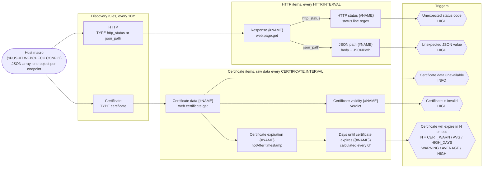

<h1 align="center">PUSH IT Webcheck</h1>

<p align="center">
  <strong>Every health endpoint and TLS certificate on a host, monitored from one Zabbix macro.</strong>
</p>

<p align="center">
  <a href="https://www.zabbix.com/"></a>
  
  
  <a href="LICENSE"></a>
</p>

**PUSH IT Webcheck** is a Zabbix template for hosts that run web services. Describe the endpoints of a host as a
JSON list in the macro `{$PUSHIT.WEBCHECK.CONFIG}`, link the template, and low-level discovery creates the items and
triggers for HTTP status codes, for values inside JSON health responses and for TLS certificate validity and expiry.
All requests are made by the Zabbix agent on the monitored host itself: `http://localhost:8080/health` means port
8080 on that machine, not on the Zabbix server, so a service bound to `localhost` or to an internal port is as easy
to check as a public one.

## 📚 Table of contents

- [Features](#-features)
- [How it works](#-how-it-works)
- [Quick start](#-quick-start)
- [Endpoint configuration](#-endpoint-configuration)
- [Configuration examples](#-configuration-examples)
- [Macros](#-macros)
- [Items and triggers](#-items-and-triggers)
- [Tips and gotchas](#-tips-and-gotchas)
- [Development](#-development)
- [License](#-license)

## ✨ Features

- 🩺 **Three check types.** `http_status` compares the response status code, `json_path` compares one value inside a
  JSON body, `certificate` watches TLS validity and expiry.
- 🧾 **One macro per host.** All endpoints live in `{$PUSHIT.WEBCHECK.CONFIG}`; no item cloning.
- 🏠 **Runs where the service runs.** Checks are Zabbix agent items, so `http://localhost:8080/health` works without
  exposing anything.
- 🧹 **Self-cleaning.** Remove an entry from the macro and its items and triggers are disabled on the next discovery
  run and deleted 7 days later; put it back before then and they return with their history.
- 📅 **Three-stage certificate alerts.** WARNING, AVERAGE and HIGH thresholds in days, chosen per endpoint.
- ⏳ **Grace periods.** A missing response becomes a problem only after a configurable grace period; a wrong value
  is reported immediately.
- 🎚️ **Tunable with macros.** Intervals and grace periods are user macros you can override per host.

## 🧭 How it works

The template ships two discovery rules of type *Script*, **HTTP** and **Certificate**. Together they turn the
endpoint list in `{$PUSHIT.WEBCHECK.CONFIG}` into items and triggers:



Step by step:

1. **Configuration.** Every endpoint is one JSON object in the host macro `{$PUSHIT.WEBCHECK.CONFIG}`. Its keys are
   LLD macros such as `{#NAME}`, `{#URL}` and `{#TYPES}`.
2. **Discovery.** Both rules run every 10 minutes and receive the macro through the script parameter `config`. A
   filter on `{#TYPES}` decides which rule handles an entry: **HTTP** takes `http_status` and `json_path`,
   **Certificate** takes `certificate`. Anything else is ignored.
3. **Raw items.** Each entry gets one Zabbix agent item that talks to the endpoint: `web.page.get["{#URL}"]` for
   HTTP entries, `web.certificate.get["{#URL}"]` for certificate entries.
4. **Derived items.** Dependent items extract the interesting part with preprocessing (regular expression and
   JSONPath). Two overrides in the HTTP rule make sure that only the dependent item matching the entry's type is
   created. The certificate rule adds a calculated item that turns the `notAfter` timestamp into days.
5. **Triggers.** Trigger prototypes compare the values with your expectations (`{#EXPECT_STATUS}`,
   `{#EXPECT_VALUE}`, `{#CERT_*_DAYS}`) and also raise a problem when no value has arrived for longer than the
   grace period.
6. **Cleanup.** Lost resources are disabled immediately and deleted after 7 days. When an entry leaves the macro, its
   items and triggers are disabled on the next discovery run. If the entry comes back within 7 days, the same items are
   enabled again with their history; otherwise items, triggers and history are deleted.

Changes to the macro take effect on the next discovery run, at most 10 minutes later, or right away with
**Execute now** on the two discovery rules.

## 🚀 Quick start

From download to the first problem in Zabbix in six steps.

### Requirements

| Requirement | Why |
|---|---|
| Zabbix server 7.4 or later | `template.yaml` is a Zabbix 7.4 export (`zabbix_export.version: '7.4'`); import it into Zabbix 7.4 or a later release. |
| A Zabbix agent on the monitored host | `http_status` and `json_path` use `web.page.get`, available in the classic Zabbix agent and in Zabbix agent 2. |
| Zabbix agent 2 for `certificate` checks | `web.certificate.get` exists in Zabbix agent 2 only. |
| An agent interface on the host | All collecting items are passive *Zabbix agent* items, so the server or proxy must be able to poll the agent. |
| A network path from the agent to the endpoints | Requests are made from the agent, not from the Zabbix server or proxy. `localhost` is the monitored host itself. |

### Steps

1. **Download** [`template.yaml`](template.yaml) from this repository.
2. **Import the template.** Go to *Data collection → Templates*, click **Import**, select `template.yaml`, keep the
   default import rules and click **Import**. **PUSH IT Webcheck** now appears in the template group *Templates*.
3. **Link it to the host** that runs the services: open the host under *Data collection → Hosts* and, on the *Host*
   tab, type `PUSH IT Webcheck` into the *Templates* field, select it and click **Update**.
4. **Configure the endpoints.** Open the host again, switch to the *Macros* tab, select *Inherited and host macros*,
   click **Change** next to `{$PUSHIT.WEBCHECK.CONFIG}` and paste your endpoint list as one line of JSON. For a
   first test, a single HTTP status check is enough (adjust the host, port and path):

   ```json
   [{"{#NAME}":"app","{#TYPES}":"http_status","{#URL}":"http://localhost:8080/health","{#EXPECT_STATUS}":"200"}]
   ```

   Click **Update**.
5. **Run discovery.** Wait for the next run (up to 10 minutes) or open *Data collection → Hosts*, click *Discovery*
   in the row of your host, select **HTTP** and **Certificate** and click **Execute now**. Give the server a few
   seconds after saving the macro so that its configuration cache has picked up the new value.
6. **Check the result.** *Monitoring → Latest data*, filtered by your host, shows **Response app** (the raw HTTP
   response) and **HTTP status app** with the value `200`. If the endpoint answers with a different status code, or
   does not answer at all for more than 3 minutes, *Monitoring → Problems* shows **Unexpected status code for app**
   with severity HIGH.

From here, extend the list with the [configuration examples](#-configuration-examples). Every later change to the
macro follows the same path: edit the value, then wait for the next discovery run or use **Execute now**.

## 🧩 Endpoint configuration

`{$PUSHIT.WEBCHECK.CONFIG}` holds a JSON array in [Zabbix LLD] format. Each element describes one check as an object
whose keys are LLD macros. Three keys are common to all checks; the value of `{#TYPES}` decides which additional keys
are needed.

> **Write every value as a JSON string**: `"200"` rather than `200`, `"true"` rather than `true`. Strings are always
> safe for low-level discovery, and this matches how the values are compared: status codes and day thresholds
> numerically, JSON values as text.

### Common keys

| Key | Description |
|---|---|
| `{#NAME}` | Unique name of the check on this host. It is used unquoted inside item keys such as `pushit.webcheck.http.status[{#NAME}]` and appears in item and trigger names, so use only letters, digits, `_`, `-` and `.`; no spaces, commas, brackets or quotes. |
| `{#URL}` | The endpoint as `scheme://host[:port][/path]`. The default port of the scheme and the root path apply when omitted. |
| `{#TYPES}` | A comma-separated list of checks to run. Allowed items: `http_status`, `json_path` or `certificate`. Any other item in the list will be ignored. |

### `http_status`

Fetches the URL every `{$PUSHIT.WEBCHECK.HTTP.INTERVAL}` (default `1m`) with the agent item
[`web.page.get`](https://www.zabbix.com/documentation/current/en/manual/config/items/itemtypes/zabbix_agent) and
compares the status code from the first line of the response. The body is not evaluated.

| Key | Description |
|---|---|
| `{#EXPECT_STATUS}` | Expected status code, compared numerically. `"200"` for a plain health endpoint, but any code works, for example `"401"` for an endpoint that is supposed to demand authentication. Any other code raises **Unexpected status code for {#NAME}** (HIGH). |

### `json_path`

Fetches the URL every `{$PUSHIT.WEBCHECK.HTTP.INTERVAL}` (default `1m`) with the same `web.page.get` item, drops
the response headers, treats the body as JSON and compares one value in it. The status code is not evaluated by this
type; add `http_status` to `{#TYPES}` if you need both.

| Key | Description |
|---|---|
| `{#JSON_PATH}` | [Zabbix JSONPath] expression selecting the value, for example `$.status` or `$.components.db.status`. Use a definite path: an expression that returns a list yields a JSON array as text, which is hard to compare. |
| `{#EXPECT_VALUE}` | Expected value, compared as a string. JSON strings arrive without quotes (`UP`), booleans and numbers as text (`true`, `200`). A mismatch raises **Unexpected JSON value for {#NAME}** (HIGH). |

### `certificate`

Opens a TLS connection every `{$PUSHIT.WEBCHECK.CERTIFICATE.INTERVAL}` (default `15m`) with the agent 2 item
[`web.certificate.get`](https://www.zabbix.com/documentation/current/en/manual/config/items/itemtypes/zabbix_agent/zabbix_agent2),
validates the certificate chain for the host name in the URL and reads the expiry date.
The URL must use the `https` scheme; a port is optional, a path is ignored. This type needs **Zabbix agent 2**.

| Key | Description |
|---|---|
| `{#CERT_WARN_DAYS}` | Days before expiry at which a WARNING problem is raised. |
| `{#CERT_AVG_DAYS}` | Days before expiry at which an AVERAGE problem is raised. |
| `{#CERT_HIGH_DAYS}` | Days before expiry at which a HIGH problem is raised. |

Choose the thresholds so that WARN > AVG > HIGH, for example `"30"`, `"14"` and `"7"`.

## 📋 Configuration examples

Every example is a complete, valid value for `{$PUSHIT.WEBCHECK.CONFIG}` and follows the rules from
[Endpoint configuration](#-endpoint-configuration): every value is a JSON string, every `{#NAME}` is unique on the
host.

The examples are pretty-printed for readability. In the macro value the same JSON is usually pasted as one line, as
shown in the [compact form](#compact-form) at the end of this section. Whitespace is irrelevant to JSON but counts
towards the 2048-character macro limit.

### 1. Minimal: one HTTP status check

A single service on port 8080 whose health endpoint must answer `200`.

```json
[
  {
    "{#NAME}": "app",
    "{#TYPES}": "http_status",
    "{#URL}": "http://localhost:8080/health",
    "{#EXPECT_STATUS}": "200"
  }
]
```

**What you get for `app`**

| Object | Name | Severity |
|---|---|---|
| Item | Response app | – |
| Item | HTTP status app | – |
| Trigger | Unexpected status code for app | HIGH |

The raw response is fetched every minute. The trigger fires when the code is not `200`, or when no code has arrived
for 3 minutes, for example because the endpoint refuses connections.

Any status code works as expectation. An endpoint behind authentication, for example, should answer `401`:

```json
[
  {
    "{#NAME}": "admin-login",
    "{#TYPES}": "http_status",
    "{#URL}": "http://localhost:9000/admin",
    "{#EXPECT_STATUS}": "401"
  }
]
```

### 2. JSON health endpoints

Spring Boot Actuator answers `GET /actuator/health` with a body such as `{"status":"UP"}`. The first entry selects
`$.status` and expects `UP`. The second watches an Elasticsearch node whose cluster health must be `green`, the
third reads a boolean from a body like `{"ready":true}`, which is compared as the string `"true"`. All three
endpoints must answer without authentication.

```json
[
  {
    "{#NAME}": "shop-api",
    "{#TYPES}": "json_path",
    "{#URL}": "http://localhost:8080/actuator/health",
    "{#JSON_PATH}": "$.status",
    "{#EXPECT_VALUE}": "UP"
  },
  {
    "{#NAME}": "search",
    "{#TYPES}": "json_path",
    "{#URL}": "http://localhost:9200/_cluster/health",
    "{#JSON_PATH}": "$.status",
    "{#EXPECT_VALUE}": "green"
  },
  {
    "{#NAME}": "worker",
    "{#TYPES}": "json_path",
    "{#URL}": "http://localhost:3000/healthz",
    "{#JSON_PATH}": "$.ready",
    "{#EXPECT_VALUE}": "true"
  }
]
```

**What you get for `shop-api`** (and the same set for `search` and `worker`)

| Object | Name | Severity |
|---|---|---|
| Item | Response shop-api | – |
| Item | JSON path shop-api | – |
| Trigger | Unexpected JSON value for shop-api | HIGH |

The trigger fires when the selected value differs from `UP`, and also when no value has arrived for 3 minutes, for
example because the service is down, the body is not JSON or the path does not match.

### 3. Certificate expiry with three thresholds

Warn 30 days before the certificate expires, escalate to AVERAGE at 14 days and to HIGH at 7 days.

```json
[
  {
    "{#NAME}": "www-cert",
    "{#TYPES}": "certificate",
    "{#URL}": "https://www.example.com",
    "{#CERT_WARN_DAYS}": "30",
    "{#CERT_AVG_DAYS}": "14",
    "{#CERT_HIGH_DAYS}": "7"
  }
]
```

**What you get for `www-cert`**

| Object | Name | Severity |
|---|---|---|
| Item | Certificate data www-cert | – |
| Item | Certificate expiration www-cert | – |
| Item | Certificate validity www-cert | – |
| Item | Days until certificate expires (www-cert) | – |
| Trigger | Certificate data for www-cert is unavailable | INFO |
| Trigger | Certificate for www-cert is invalid | HIGH |
| Trigger | Certificate for www-cert will expire in 30 or less | WARNING |
| Trigger | Certificate for www-cert will expire in 14 or less | AVERAGE |
| Trigger | Certificate for www-cert will expire in 7 or less | HIGH |

The certificate data is fetched every 15 minutes, the days value is recalculated every 6 hours. Use the name the
certificate was issued for (here `www.example.com`), not `localhost`, otherwise the check reports `invalid`.

### 4. A realistic host: several services, all three types

A shop server. The public storefront is checked through its own name, once for the status code and once for the
certificate. Two Spring Boot services answer with JSON health, a protected admin interface is expected to answer `401`
without credentials, and an API on port 8443 has a certificate of its own. `billing-db` reads a component status,
which Actuator only includes when `management.endpoint.health.show-components` or `show-details` is set to `always`
(`when-authorized` does not help, the agent sends no credentials).

```json
[
  {
    "{#NAME}": "shop-frontend",
    "{#TYPES}": "http_status",
    "{#URL}": "https://shop.example.com/",
    "{#EXPECT_STATUS}": "200"
  },
  {
    "{#NAME}": "shop-cert",
    "{#TYPES}": "certificate",
    "{#URL}": "https://shop.example.com/",
    "{#CERT_WARN_DAYS}": "30",
    "{#CERT_AVG_DAYS}": "14",
    "{#CERT_HIGH_DAYS}": "7"
  },
  {
    "{#NAME}": "orders-api",
    "{#TYPES}": "json_path",
    "{#URL}": "http://localhost:8080/actuator/health",
    "{#JSON_PATH}": "$.status",
    "{#EXPECT_VALUE}": "UP"
  },
  {
    "{#NAME}": "billing-db",
    "{#TYPES}": "json_path",
    "{#URL}": "http://localhost:8081/actuator/health",
    "{#JSON_PATH}": "$.components.db.status",
    "{#EXPECT_VALUE}": "UP"
  },
  {
    "{#NAME}": "admin-auth",
    "{#TYPES}": "http_status",
    "{#URL}": "http://localhost:9000/admin/",
    "{#EXPECT_STATUS}": "401"
  },
  {
    "{#NAME}": "api-cert",
    "{#TYPES}": "certificate",
    "{#URL}": "https://api.example.com:8443",
    "{#CERT_WARN_DAYS}": "21",
    "{#CERT_AVG_DAYS}": "10",
    "{#CERT_HIGH_DAYS}": "3"
  }
]
```

### 5. Two checks for the same endpoint

You can specify multiple checks in `{#TYPES}` as comma-separated list. The following example checks whether the endpoint
returns an HTTP 200 status code and whether the field `$.status` holds the value `"UP"`.

```json
[
  {
    "{#NAME}": "payments-status",
    "{#TYPES}": "http_status,json_path",
    "{#URL}": "http://localhost:8080/actuator/health",
    "{#EXPECT_STATUS}": "200",
    "{#JSON_PATH}": "$.status",
    "{#EXPECT_VALUE}": "UP"
  }
]
```

### Compact form

The macro value is the same JSON without line breaks and indentation. This is
[example 4](#4-a-realistic-host-several-services-all-three-types) exactly as it goes into the macro field:

```json
[{"{#NAME}":"shop-frontend","{#TYPES}":"http_status","{#URL}":"https://shop.example.com/","{#EXPECT_STATUS}":"200"},{"{#NAME}":"shop-cert","{#TYPES}":"certificate","{#URL}":"https://shop.example.com/","{#CERT_WARN_DAYS}":"30","{#CERT_AVG_DAYS}":"14","{#CERT_HIGH_DAYS}":"7"},{"{#NAME}":"orders-api","{#TYPES}":"json_path","{#URL}":"http://localhost:8080/actuator/health","{#JSON_PATH}":"$.status","{#EXPECT_VALUE}":"UP"},{"{#NAME}":"billing-db","{#TYPES}":"json_path","{#URL}":"http://localhost:8081/actuator/health","{#JSON_PATH}":"$.components.db.status","{#EXPECT_VALUE}":"UP"},{"{#NAME}":"admin-auth","{#TYPES}":"http_status","{#URL}":"http://localhost:9000/admin/","{#EXPECT_STATUS}":"401"},{"{#NAME}":"api-cert","{#TYPES}":"certificate","{#URL}":"https://api.example.com:8443","{#CERT_WARN_DAYS}":"21","{#CERT_AVG_DAYS}":"10","{#CERT_HIGH_DAYS}":"3"}]
```

You can use `jq` to produce the compact form from a pretty-printed file and if you chain it with `wc`, you can count the
characters to ensure you stay below the Zabbix-imposed 2048-character limit:

```sh
jq -c . webcheck.json            # validate and print the compact form
jq -cj . webcheck.json | wc -m   # count its characters: at most 2048 fit into a macro value
```

## 🔢 Macros

All macros are defined on the template and can be overridden per host. Time values are Zabbix time expressions such as
`30s`, `5m`, `1h` or `2d`.

| Macro | Default | Used by | Purpose |
|---|---|---|---|
| `{$PUSHIT.WEBCHECK.CONFIG}` | `[]` | discovery rules | The endpoint list, a JSON array in LLD format. Set this on every host. |
| `{$PUSHIT.WEBCHECK.HTTP.INTERVAL}` | `1m` | `http_status`, `json_path` | Update interval of the raw item **Response {#NAME}**. |
| `{$PUSHIT.WEBCHECK.HTTP_STATUS.NO_STATUS_GRACE}` | `3m` | `http_status` | How long a missing status code is tolerated before **Unexpected status code for {#NAME}** fires. Must be larger than `HTTP.INTERVAL`, otherwise it provides no tolerance and can raise false no-data problems. |
| `{$PUSHIT.WEBCHECK.JSON_PATH.NO_RESPONSE_GRACE}` | `3m` | `json_path` | How long a missing response is tolerated before **Unexpected JSON value for {#NAME}** fires. Must be larger than `HTTP.INTERVAL`, otherwise it provides no tolerance and can raise false no-data problems. |
| `{$PUSHIT.WEBCHECK.CERTIFICATE.INTERVAL}` | `15m` | `certificate` | Update interval of the raw item **Certificate data {#NAME}**. |
| `{$PUSHIT.WEBCHECK.CERTIFICATE.NO_DATA_GRACE}` | `30m` | `certificate` | How long missing certificate data is tolerated before **Certificate data for {#NAME} is unavailable** (INFO) fires. Must be larger than `CERTIFICATE.INTERVAL` and smaller than `CERTIFICATE.HISTORY`. |
| `{$PUSHIT.WEBCHECK.CERTIFICATE.HISTORY}` | `90m` | `certificate` | History retention of the raw certificate JSON only. Must be larger than `CERTIFICATE.NO_DATA_GRACE`, should be larger than `CERTIFICATE.INTERVAL` and must be at least `1h`. The derived items are not affected. |

### Keep the timing consistent

Timing at a glance, with the default values:

| Check type | Raw item collected every | No-data grace before the trigger fires | Raw history kept for |
|---|---|---|---|
| `http_status` | `{$PUSHIT.WEBCHECK.HTTP.INTERVAL}` = 1m | `{$PUSHIT.WEBCHECK.HTTP_STATUS.NO_STATUS_GRACE}` = 3m | never |
| `json_path` | `{$PUSHIT.WEBCHECK.HTTP.INTERVAL}` = 1m | `{$PUSHIT.WEBCHECK.JSON_PATH.NO_RESPONSE_GRACE}` = 3m | never |
| `certificate` | `{$PUSHIT.WEBCHECK.CERTIFICATE.INTERVAL}` = 15m | `{$PUSHIT.WEBCHECK.CERTIFICATE.NO_DATA_GRACE}` = 30m | `{$PUSHIT.WEBCHECK.CERTIFICATE.HISTORY}` = 90m |

Two rules follow from this:

- **Grace periods must be larger than the interval.** The grace period is the argument of `nodata()`. If it is
  equal to or shorter than the interval, the window runs out between two regular polls and the trigger can raise
  problems on a healthy endpoint. The defaults (1m interval, 3m grace) tolerate two missed polls.
- **`CERTIFICATE.INTERVAL < CERTIFICATE.NO_DATA_GRACE < CERTIFICATE.HISTORY`.** The certificate `nodata()` trigger
  watches the raw item **Certificate data {#NAME}**, whose history is set by `CERTIFICATE.HISTORY`, so the history
  has to outlast the grace period. When you raise one, raise the other with it. The HTTP `nodata()` triggers watch
  the dependent items, which keep the Zabbix default history of 31d, so no such rule applies to them.

## 📦 Items and triggers

Every discovered object carries the `{#NAME}` of its entry, so items and triggers of different services never
collide and are easy to tell apart in *Latest data* and *Problems*.

| Discovery rule | Key | Type | Runs | Accepts entries with | Lost resources |
|---|---|---|---|---|---|
| **HTTP** | `pushit.webcheck.discovery.http` | Script | every 10m | `{#TYPES}` containing `http_status` or `json_path` | Disable immediately, delete after 7d |
| **Certificate** | `pushit.webcheck.discovery.certificate` | Script | every 10m | `{#TYPES}` containing `certificate` | Disable immediately, delete after 7d |

Both rules receive `{$PUSHIT.WEBCHECK.CONFIG}` as the script parameter `config` and return the value of
`JSON.parse(value).config`.

The **HTTP** rule creates its two dependent prototypes with *Discover* set to *No* and switches on the matching one
with an override, so each HTTP entry ends up with the raw item plus exactly one dependent item:

| Override | Condition | Effect |
|---|---|---|
| Enable http_status | `{#TYPES}` contains `http_status` | Item prototypes whose name matches `^HTTP status.*$` are discovered |
| Enable json_path | `{#TYPES}` cotnains `json_path` | Item prototypes whose name matches `^JSON path.*$` are discovered |

<details>
<summary><strong>http_status</strong>: items and triggers</summary>

| Item | Key | Type | Value type | Interval | History |
|---|---|---|---|---|---|
| Response {#NAME} | `web.page.get["{#URL}"]` | Zabbix agent | Text | `{$PUSHIT.WEBCHECK.HTTP.INTERVAL}` | none |
| HTTP status {#NAME} | `pushit.webcheck.http.status[{#NAME}]` | Dependent on Response {#NAME} | Numeric (unsigned) | with the master item | 31d (Zabbix default) |

**Response {#NAME}** holds the raw response: status line, headers and body. **HTTP status {#NAME}** extracts the
three-digit status code from the status line with one *Regular expression* preprocessing step, pattern
`\AHTTP/[0-9.]+[ \t]+([0-9]{3})(?:[ \t]|\r?\n)` and output `\1`.

| Trigger | Severity | Condition |
|---|---|---|
| Unexpected status code for {#NAME} | HIGH | No status code for `{$PUSHIT.WEBCHECK.HTTP_STATUS.NO_STATUS_GRACE}`, or the last code differs from `{#EXPECT_STATUS}`. |

</details>

<details>
<summary><strong>json_path</strong>: items and triggers</summary>

| Item | Key | Type | Value type | Interval | History |
|---|---|---|---|---|---|
| Response {#NAME} | `web.page.get["{#URL}"]` | Zabbix agent | Text | `{$PUSHIT.WEBCHECK.HTTP.INTERVAL}` | none |
| JSON path {#NAME} | `pushit.webcheck.http.json_path[{#NAME}]` | Dependent on Response {#NAME} | Text | with the master item | 31d (Zabbix default) |

**Response {#NAME}** is the same raw item as for `http_status`. **JSON path {#NAME}** has two preprocessing steps: a
*Regular expression* step with the pattern `\r?\n\r?\n([\s\S]*)` and the output `\1` drops the headers and keeps the
body, then a *JSONPath* step applies `{#JSON_PATH}`.

| Trigger | Severity | Condition |
|---|---|---|
| Unexpected JSON value for {#NAME} | HIGH | No value for `{$PUSHIT.WEBCHECK.JSON_PATH.NO_RESPONSE_GRACE}`, or the last value differs from `{#EXPECT_VALUE}`. |

</details>

<details>
<summary><strong>certificate</strong>: items and triggers</summary>

| Item | Key | Type | Value type | Interval | History |
|---|---|---|---|---|---|
| Certificate data {#NAME} | `web.certificate.get["{#URL}"]` | Zabbix agent (agent 2) | Text | `{$PUSHIT.WEBCHECK.CERTIFICATE.INTERVAL}` | `{$PUSHIT.WEBCHECK.CERTIFICATE.HISTORY}` |
| Certificate expiration {#NAME} | `pushit.webcheck.certificate.not_after[{#NAME}]` | Dependent on Certificate data {#NAME} | Numeric (unsigned) | with the master item | 31d (Zabbix default) |
| Certificate validity {#NAME} | `pushit.webcheck.certificate.is_valid[{#NAME}]` | Dependent on Certificate data {#NAME} | Text | with the master item | 31d (Zabbix default) |
| Days until certificate expires ({#NAME}) | `pushit.webcheck.certificate.days_until_expiration[{#NAME}]` | Calculated | Numeric (float), unit `days` | `6h` | 31d (Zabbix default) |

**Certificate data {#NAME}** holds the raw certificate JSON. **Certificate expiration {#NAME}** takes
`$.x509.not_after.timestamp` from it (the *notAfter* date as a Unix timestamp), **Certificate validity {#NAME}**
takes `$.result.value` (`valid`, `invalid` or `valid-but-self-signed`), and **Days until certificate expires
({#NAME})** is calculated as `round((last(//pushit.webcheck.certificate.not_after[{#NAME}]) - now()) / 86400, 1)`.

| Trigger | Severity | Condition |
|---|---|---|
| Certificate data for {#NAME} is unavailable | INFO | No certificate data for `{$PUSHIT.WEBCHECK.CERTIFICATE.NO_DATA_GRACE}`. |
| Certificate for {#NAME} is invalid | HIGH | The validity value is anything other than `valid`. |
| Certificate for {#NAME} will expire in {#CERT_WARN_DAYS} or less | WARNING | Days until expiry `<= {#CERT_WARN_DAYS}`. |
| Certificate for {#NAME} will expire in {#CERT_AVG_DAYS} or less | AVERAGE | Days until expiry `<= {#CERT_AVG_DAYS}`. |
| Certificate for {#NAME} will expire in {#CERT_HIGH_DAYS} or less | HIGH | Days until expiry `<= {#CERT_HIGH_DAYS}`. |

The three expiry triggers are independent of each other: once the days drop to the HIGH threshold, all three are
in problem state.

</details>

## 💡 Tips and gotchas

- **Renaming an entry recreates it.** `{#NAME}` is part of the item keys, so a renamed entry produces new items and
  triggers. The new items start without history; the old ones are disabled and deleted with their history 7 days later.
- **Plain requests from the agent.** `web.page.get` and `web.certificate.get` send unauthenticated requests without
  custom headers or body, so point them at endpoints that answer anonymously. To verify that a protected endpoint is up,
  use `http_status` with `{#EXPECT_STATUS}` `"401"`. The requests originate on the monitored host: firewalls between the
  agent and the service matter, firewalls between the Zabbix server and the service do not.
- **Certificate checks need `https` and Zabbix agent 2.** For obvious reasons, `web.certificate.get` accepts only the
  `https` scheme. For less obvious reasons it exists only in agent 2. On a host with the classic agent,
  **Certificate data {#NAME}** becomes *Not supported* and an INFO-level problem will be triggered after 30 minutes.
- **`https` in HTTP checks needs cURL in the classic agent.** The classic Zabbix agent must be built with cURL
  support to fetch `https` URLs with `web.page.get`, otherwise the item becomes *Not supported*. Zabbix agent 2 has
  no such requirement.
- **Point certificate checks at the certificate's name.** The certificate is validated for the host name in the
  URL, so `https://shop.example.com` reports `valid` where `https://localhost` reports `invalid` for the same
  certificate. Self-signed certificates yield `valid-but-self-signed`, which also fires **Certificate for {#NAME}
  is invalid**.
- **Removed entries are disabled, then deleted.** An entry taken out of the macro has its items and triggers disabled on
  the next discovery run and deleted with their history 7 days later. Until then a slip in the macro can be undone: put
  the entry back and the same items return with their history. If you want to disable an item, select it on the item
  list of the host and click *Disable* instead of removing it from the macro.
- **Invalid JSON stops discovery.** If the macro is not valid JSON, both discovery rules turn *Not supported* with
  the parse error shown in the rule status. Existing items stay as they are until the macro is fixed.
- **Unknown values in `{#TYPES}` are ignored.** A typo such as `http-status` matches neither rule and produces no items,
  no triggers and no error. Check the *Items* and *Latest data* views after adding an entry and executing the discovery
  rule.
- **The macro value is limited to 2048 characters.** Keep the JSON compact and the names and URLs short. Depending
  on URL length, somewhere between a dozen and twenty entries fit into one macro. Count the characters as shown in
  [compact form](#compact-form).
- **Missing certificate data is only INFO.** The nodata trigger of the raw certificate item has severity INFO. The
  alerts that matter come from the validity and expiry triggers. If you want it louder, raise the severity of the
  trigger prototype **Certificate data for {#NAME} is unavailable** after import.
- **The days value moves every 6 hours.** The item **Days until certificate expires ({#NAME})** is a calculated item
  with a 6-hour interval. The first value appears shortly after discovery, afterwards it is refreshed only every 6 hours,
  so after a renewal the expiry problems resolve on the next run. Click **Execute now** on the item to refresh it
  immediately and clear the problem.
- **Slow endpoints and the item timeout.** The item prototypes set no timeout of their own, so the global timeout
  for Zabbix agent items (default 3 seconds, *Administration → General → Timeouts*) or the proxy's timeout applies.
  Raise it if a health endpoint needs longer than that.
- **Test a check by hand.** Run the item key on the monitored host with the agent binary, for example
  `zabbix_agent2 -t 'web.page.get["http://localhost:8080/health"]'` or
  `zabbix_agent2 -t 'web.certificate.get["https://www.example.com"]'` (`zabbix_agentd -t ...` for the classic
  agent), or from the server with `zabbix_get -s <agent address> -k 'web.page.get["http://localhost:8080/health"]'`.
  The returned value is exactly what **Response {#NAME}** or **Certificate data {#NAME}** will store.

## 🔧 Development

The whole template is `template.yaml`, a Zabbix 7.4 YAML export. Keep it lint-clean with
[yamllint](https://github.com/adrienverge/yamllint). The program is packaged for all major operating systems and
installation instructions for manual installation are available on its Github repo. The configuration for yamllint is
stored in the default, project-local rule file `.yamllint.yaml`.

To verify a change functionally, import the file into a test Zabbix (importing again updates the existing
template), link it to a host with an agent, set a small `{$PUSHIT.WEBCHECK.CONFIG}` and run **Execute now** on both
discovery rules. Keep the `uuid` values in the file: they tie every object to its counterpart in an existing
installation, so re-importing updates instead of duplicating.

## 📄 License

Apache License 2.0, see [LICENSE](LICENSE).

[Zabbix LLD]: https://www.zabbix.com/documentation/current/en/manual/discovery/low_level_discovery
[Zabbix JSONPath]: https://www.zabbix.com/documentation/current/en/manual/config/items/preprocessing/jsonpath_functionality
